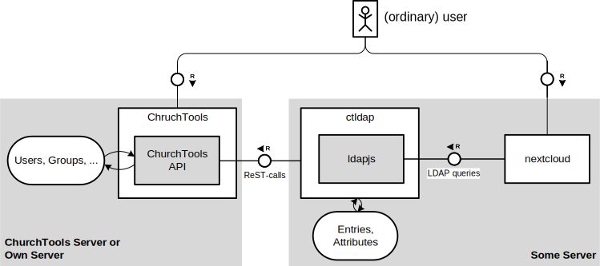

[](https://github.com/EfG-Haigerseelbach/ctldap/actions/workflows/node.js.yml)
[](https://coveralls.io/github/EfG-Haigerseelbach/ctldap?branch=develop)

# LDAP Wrapper for ChurchTools

ctldap serves as LDAP server for [ChurchTools](https://church.tools) with the purpose to enable ordinary ChurchTools-users to access other services which offer an LDAP-integration (e.g. nextcloud) with the same username and password. Therefore, an LDAP server in form of [ldapjs](http://ldapjs.org/) is used. The relevant LDAP operations are forwarded to a ChurchTools installation using its [API](https://api.church.tools/). User and group data is only cached in ctldap (transient).



# Configuration
Unlike the [original version of ctldap](https://github.com/milux/ctldap) the fork uses a [JSON-based configration file](https://github.com/EfG-Haigerseelbach/ctldap/blob/develop/config/test.json) as well as module [node-config](https://github.com/lorenwest/node-config). In this configuration approach there are the following options:

## LDAP

The LDAP server offers the following options:

| Parameter                    | Data Type | Example       | Explanation                                                                                                                                                                                                                                     |
|------------------------------|-----------|---------------|-------------------------------------------------------------------------------------------------------------------------------------------------------------------------------------------------------------------------------------------------|
| `ldap_user`                  | string    | `root`        | LDAP admin user, can be a "virtual" root user or a ChurchTools user name (virtual root is recommended!)                                                                                                                                         |
| `ldap_password`              | string    | `secret`      | The static password to be used for the ldap_user if it is NOT a CT account, or the account password of the  chosen user otherwise. If you did not use install.sh, choose a LONG SECURE RANDOM password from a password generator like KeePass!  |
| TBD: `ldap_password_bycrypt` | boolean   | `true`        | If set to true, treat ldap_password as a bcrypt hash and compare against it                                                                                                                                                                     |
| `ldap_ip`                    | string    | `127.0.0.1`   | LDAP server ip to listen on, change it to 0.0.0.0 when external access required. When you use the iptables_port setting, the port forwarding is stil installed on the eth0 card                                                                 |
| `ldap_port`                  | string    | `1389`        | LDAP server port                                                                                                                                                                                                                                |
| TBD: `iptables_port`         | string    | `389`         | The ctldap.sh service script will try to read this and setup an iptables NAT rule on interface eth0 from iptables_port to ldap_port if it is set                                                                                                |
| `ldap_base_dn`               | string    | `churchtools` | LDAP base DN (o=xxx)                                                                                                                                                                                                                            |

## ChurchTools

## Log Level

TBD

## Debug Output

For debugging purposes the debug output of the following functions (!= JS functions but rather scopes) can be individually switched on/ off:

- `getUsersData`
- `csrfToken`
- `getCsrfToken`
- `requestUsers`
- `apiPost`
- `apiPostOptions`
- tbd

# Installation
Node.js is required to run this software.
http://nodejs.org/

## Node.js install

### Run the install.sh script as root user. It will
- run "npm install" to install required Node.js dependencies for the server
- create a new user "ctldap" to run the server with limited privileges
- create the configuration file, asking for a reset if it already exists
- *[new config or reset]* ask for the ChurchTools domain (and directory)
- *[new config or reset]* ask for the ChurchTools API user credentials and insert them into the config file
- *[new config or reset]* insert a secure random LDAP root user password into the config file
- *[new config or reset]* offer to customize the config file
- *optionally adapt and create the ctldap.sh file in /etc/init.d and call "update-rc.d ctldap.sh defaults"*

#### ctldap.sh remarks:
The file "ctldap.sh" contains a shell script for (re)starting ctldap.sh with Node.js as a background service, redirecting all output to the system log with systemd-cat. The logs can be reviewed with the shell command `journalctl -t ctldap`. See https://wiki.ubuntuusers.de/systemd/journalctl/ for further options.

The script will attempt to create/remove an iptables NAT rule on start/stop in order to redirect traffic from a standard LDAP port (< 1024) to ldap_port without root.

It can be used to start/stop the service manually, but will not work correctly without root privileges!

Usage: ctldap.sh {start|stop|status|restart}

### If you don't have root privileges:
- run `yarn install` or `npm install` manually or otherwise trigger the installation of required dependencies
- copy "ctldap.example.config" to "ctldap.config" and adjust the required settings accordingly
- register "ctldap.js" to be run by Node.js, or start the server directly by executing `node ctldap.js`

# Usage
The LDAP DNs depend on your configuration. Let's assume the following configuration:
```
ldap_user=root
ldap_password=0a1b2c3d4e5f6g7h8i9j
ldap_base_dn=churchtools
```
For this configuration, the
- admin DN for initial binding is `cn=root,ou=users,o=churchtools`
- password for initial binding is `0a1b2c3d4e5f6g7h8i9j`
- users are found in the organizational unit `ou=users,o=churchtools`
- groups are found in the organizational unit `ou=groups,o=churchtools`

# Testing

1. Run `npm install`.
2. Run `npm run coverage`.
